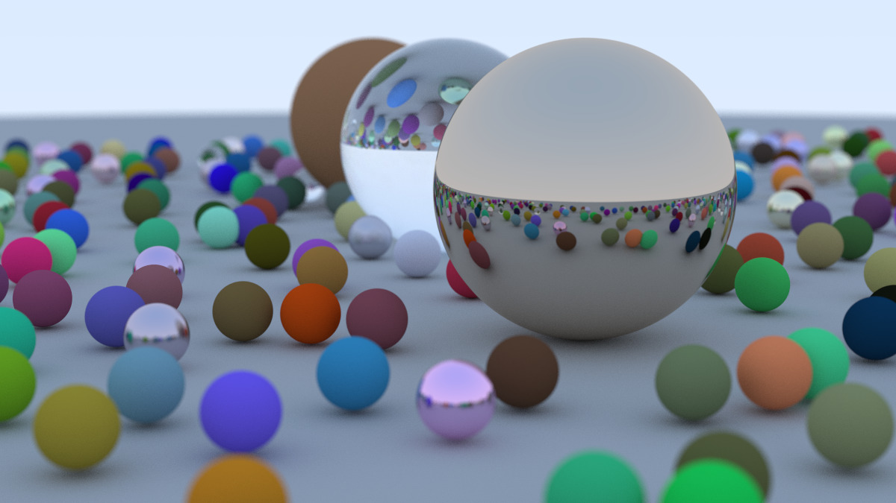

# Ray Tracing in (More Than) One Weekend

A attempt at the [Ray Tracing in One Weekend](https://raytracing.github.io/books/RayTracingInOneWeekend.html) book, in C.

## Usage

```
$ make
$ ./main > cover.ppm
```

The resulting image is the cover image of the book: 1200x675px, 500 samples/pixel.



The original, single-threaded implementation ran in 18m 41s with optimization flags enabled. Further optimizations reduced the time to 3m 31s, a 5.3x speedup. Here's a summary of optimizations with a smaller test image (`./main -small`) - 400x225px, 100 samples/pixel.

| Optimization                                              | real   | user  | sys  | cpu% |
| --------------------------------------------------------- | ------ | ----- | ---- | ---- |
| Optimization flags (`-O2`, `-flto`)                       | 24.568 | 24.52 | 0.01 | 99   |
| Multi-threaded pixel rendering (4 threads)                | 13.817 | 33.93 | 8.31 | 305  |
| Multi-threaded scanline rendering                         | 9.459  | 36.43 | 0.02 | 385  |
| Multi-threaded scanlines rendering                        | 9.261  | 36.68 | 0.01 | 396  |
| Changing function pointer to enums + union                | 7.855  | 31.10 | 0.01 | 396  |
| Use custom inline random instead of stdlib `rand()`       | 7.690  | 30.40 | 0.01 | 395  |
| Change `raycolor()` to be iterative instead of recursive  | 7.519  | 29.72 | 0.01 | 395  |
| Use ARM Neon SIMD instructions in vector functions        | 7.066  | 27.91 | 0.01 | 395  |
| Use SIMD instructions to calculate 4 spheres at once      | 6.085  | 24.01 | 0.01 | 394  |
| Improved data loading for "4 spheres at once"             | 5.847  | 23.09 | 0.01 | 395  |
| Vectorized discrimiant check in `spherelisthit()`         | 4.902  | 19.32 | 0.01 | 394  |
| Small improvements in `spherelisthit()`                   | 4.743  | 18.70 | 0.01 | 394  |

## Resources
- [jacobvosmaer/raytracingweekend](https://github.com/jacobvosmaer/raytracingweekend/) + accompanying [blog post](http://blog.jacobvosmaer.nl/0022-ray-tracing-weekend/)
- [jfeintzeig/ray_tracer](https://github.com/JFeintzeig/ray_tracer) + accompanying [blog post](https://www.jakef.science/posts/simd-parallelism/)
- [ARM Neon Instruction Set](https://developer.arm.com/architectures/instruction-sets/intrinsics/#f:@navigationhierarchiessimdisa=[Neon])
